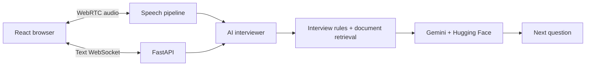

# Interview

**AI interview practice with answer-aware questions, resume retrieval, and a browser voice interface.**

Built by **Yash Jain** to explore the engineering behind an AI interviewer: real-time audio, model orchestration, retrieval, and structured feedback.

[Architecture](docs/architecture.md) · [Local setup](docs/getting_started.md) · [API](docs/api.md) · [Project status](docs/project_status.md)

## At a glance

| What | Why it matters |
|---|---|
| React interview workspace | Brings setup, conversation, and example feedback into one candidate journey. |
| FastAPI + WebSockets | Keeps text questions and answers on a persistent connection. |
| WebRTC audio pipeline | Connects browser audio to speech recognition, AI generation, and speech synthesis. |
| Resume and job retrieval | Grounds follow-up prompts in relevant document passages. |
| Gemini + Hugging Face | Separates model providers behind a shared response interface. |
| Rubric-based evaluation | Produces structured scores and written improvement suggestions. |

**Current stage: development prototype.** Text interview wiring and AI components exist; voice has known integration defects. Dashboard, history, and report screens use sample data. Authentication, saved reports, and production deployment are not implemented. See [verified scope and limitations](docs/project_status.md).

## Demo

**Walkthrough video: coming after the platform is completed.**

To explore the interface today, run the frontend below. Review dashboard → interview setup → live room → example report. With no backend, the live room can show demo responses; this demonstrates the interface, not a completed AI interview.

## How it works



Text and voice currently create separate interview instances. The voice path uses Whisper and Edge TTS; its complete round trip is not yet working reliably.

## Engineering highlights

- **Provider abstraction:** common response objects carry text, provider, latency, and errors; generation runs concurrently across two providers.
- **Focused context:** text documents are chunked and indexed with FAISS; the latest answer retrieves passages for follow-up prompts.
- **Explicit contracts:** WebSocket events drive text interaction; Pydantic models define evaluation output.
- **Clear boundaries:** transport, speech processing, prompts, retrieval, evaluation, and session state live in separate modules.

[Design decisions and trade-offs](docs/architecture.md#design-decisions) explain the costs and limits of these choices. No latency, accuracy, or scale benchmarks are claimed.

## Try the interface

Use a current Node.js LTS release compatible with the installed Vite version. The frontend lockfile records the dependency versions.

```bash
cd frontend/web
npm ci
cp .env.example .env
npm run dev
```

Open the local URL printed by Vite. Backend setup needs provider credentials, speech dependencies, and local retrieval indexes; follow [the backend guide](docs/getting_started.md#backend-development).

## Repository map

```text
frontend/web/       React + TypeScript interface
backend/api/        FastAPI application
backend/realtime/   WebRTC, WebSockets, speech pipeline, sessions
backend/ai/         Interviewer, model router, prompts, RAG, evaluation
backend/mcp/        In-process context host and providers
backend/memory/     In-memory session and evaluation state
tests/             Manual experiments; not a regression suite
docs/              Setup, contracts, design, and operations
```

The `mcp` directory is an in-process context abstraction; it does not implement the standard MCP wire protocol.

## Documentation

| Start here | Go deeper |
|---|---|
| [Setup and troubleshooting](docs/getting_started.md) | [Architecture](docs/architecture.md) |
| [API and event examples](docs/api.md) | [Retrieval](docs/rag_design.md) |
| [Current capabilities](docs/project_status.md) | [Voice pipeline](docs/realtime_pipeline.md) |
| [Validation](docs/testing.md) | [Context orchestration](docs/mcp_design.md) |
| [Deployment and operations](docs/deployment.md) | [Security and data handling](SECURITY.md) |

[Security](SECURITY.md) · [License status](docs/licensing.md)

**Author:** Yash Jain · AI systems and backend engineering
