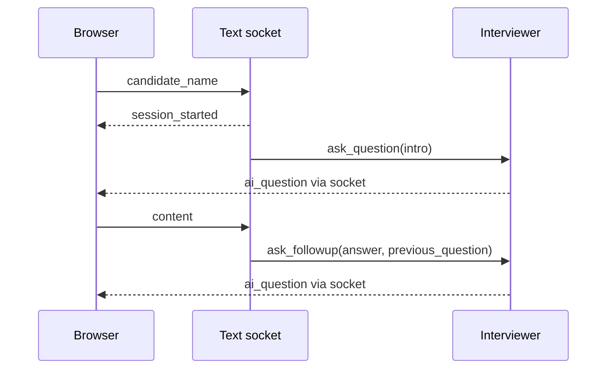

# API and events

Base URL for local development: `http://localhost:8000`. Routes are registered in [`backend/api/main.py`](../backend/api/main.py). No authentication is implemented.

| Transport | Route | Contract |
|---|---|---|
| GET | `/health` | Returns `{"status":"ok"}` once the app starts. |
| POST | `/webrtc/offer` | Accepts an SDP offer and returns an SDP answer. |
| WebSocket | `/ws/interview` | Candidate initialization, answers, and AI questions. |
| WebSocket | `/ws/audio` | Experimental binary audio route; currently broken. |

FastAPI exposes HTTP schemas at `/docs`. WebSocket event contracts are described below.

## Text interview

Connect to `ws://localhost:8000/ws/interview`. Send initialization first:

```json
{"candidate_name":"Demo Candidate"}
```

The server returns a session event, then a question:

```json
{"event":"session_started","session_id":"<generated UUID>","stage":"intro"}
```

```json
{"event":"ai_question","content":"Tell me about a project you built."}
```

Send an answer:

```json
{"content":"I built a retrieval service for technical documents."}
```

The next response is another `ai_question`. Evaluation is computed internally when a previous question exists, but is not sent to the client. Empty answers are skipped.



Disconnect removes the process-local session. There are no resume-upload, report, history, start/end HTTP, or session-resume endpoints. Error events and close codes are not standardized; provider failures may terminate processing.

## WebRTC signaling

```json
{"sdp":"<browser offer SDP>","type":"offer"}
```

The response has the same shape with `type: "answer"`. Media travels over the peer connection, not the HTTP response. Text and voice do not share session identity. Known audio and ICE limitations are listed in [voice documentation](realtime_pipeline.md).

## Audio socket

The handler accepts binary messages and attempts to return synthesized audio. Its call to `process_audio_chunck` has no matching pipeline method. Treat this as an unfinished interface, not a supported fallback.
