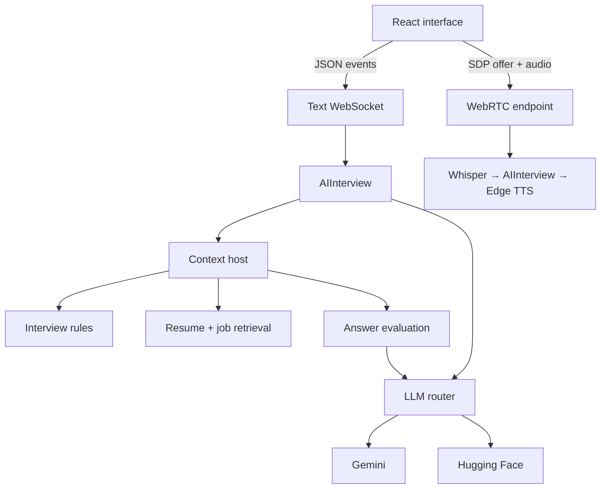

# Architecture

The platform separates the candidate interface, transport, AI generation, and document context. This makes each layer easier to inspect and replace.

## Main components

Text and voice instantiate separate interviewers. This is a code dependency diagram; it does not imply a shared session or a working voice round trip.

| Boundary | Source | Responsibility |
|---|---|---|
| UI | `frontend/web/src/App.tsx` | Routes, setup, transcript display, microphone and text controls |
| API | `backend/api/main.py` | Registers health, signaling, and socket routes |
| Transport | `backend/realtime/` | Peer connections, socket messages, audio conversion |
| Interview | `backend/ai/interviewer.py` | Creates prompts and requests the next question |
| Context | `backend/mcp/` | Combines rules, retrieved passages, and optional evaluation |
| Models | `backend/ai/llm_router/` | Calls providers, scores responses, selects a result |
| State | `backend/realtime/sessions/`, `backend/memory/` | Process-local sessions and evaluation lists |

## Design decisions

| Choice | Benefit | Trade-off in this implementation |
|---|---|---|
| WebSocket text events | A persistent request/response conversation | Reconnect, event validation, and recovery are incomplete. |
| WebRTC audio | Browser media transport and playback | ICE/TURN setup and audio lifecycle need integration validation. |
| Concurrent model calls | More than one candidate response | Waits for both providers and adds judge calls; no measured latency advantage. |
| Local FAISS indexes | Simple document retrieval | Fixed shared indexes; no candidate ownership or upload isolation. |
| In-process context providers | Easy separation of responsibilities | Sequential collection; no standard MCP transport or remote service boundary. |
| In-memory state | Simple local development | Lost on restart and unavailable across workers. |

The response judge currently misreads the provider response object and falls back to zero scores. Selection therefore does not provide reliable quality ranking.

## State and lifecycle

A text connection creates a UUID session at `intro`. Answers trigger retrieval, optional evaluation, and follow-up generation. The stage does not advance automatically. Disconnect removes the session; no durable transcript or final report is saved.

The voice offer creates a separate peer connection and speech pipeline. It does not reuse the text session ID. See [voice details](realtime_pipeline.md) and [current scope](project_status.md).
