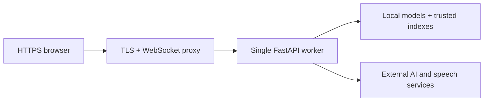

# Deployment and operations

The frontend can be hosted as an interface demonstration. The backend is a development prototype with unresolved startup, voice, security, and persistence gaps. No live deployment is verified in this repository.

## Frontend hosting

| Setting | Value |
|---|---|
| Project root | `frontend/web` |
| Install | `npm ci` |
| Build | `npm run build` |
| Output | `dist` |
| HTTP origin | `VITE_API_URL=https://<backend-origin>` |
| Socket origin | `VITE_WS_URL=wss://<backend-origin>` |

`frontend/web/vercel.json` provides an SPA rewrite to `index.html`. Other hosts need an equivalent rule. Environment values are embedded during the build; rebuild to change them. Verify direct navigation to `/interview/live` and `/reports/latest`.

Use HTTPS for hosted microphone access. Clearly label demo responses, static charts, and sample reports in any published walkthrough.

## Backend operating constraints

This illustrates operating dependencies, not infrastructure already provisioned.

- Start from the repository root using the [setup guide](getting_started.md). Provision ffmpeg, model caches, credentials, and trusted indexes first.
- Keep one worker while sessions remain process-local. A restart discards sessions; more workers do not share state.
- `/health` is a basic liveness response. It does not check provider access, retrieval readiness, or voice playback.
- Configure TLS and WebSocket proxy upgrades; WebRTC additionally needs verified ICE candidate exchange and TURN/UDP connectivity.
- There is no Dockerfile, Compose configuration, CI release pipeline, or backend hosting manifest.

## Before public backend access

Require a verified clean install and interview lifecycle, working voice cleanup, bounded queues, provider timeouts, request limits, restricted origins, and authentication/ownership controls. Provide durable results and explicit data retention/deletion rules. Validate concurrent sessions and cross-network audio before claiming public service readiness.

These are release conditions, not features currently provided.

## Observability and recovery

Current logging uses prints and can expose prompts, transcripts, and document context. Raw/processed debug audio may remain on disk. No metrics, alerts, retention policy, or redaction layer is implemented.

For operations, record session IDs, error categories, provider latency, queue sizes, and active connections without logging candidate content. Investigate startup/index/provider failures separately. Stop accepting sessions before shutdown; current worker cleanup is incomplete.

For a frontend rollback, redeploy a previously verified build. Backend recovery currently requires restarting the process and recreating lost sessions; there is no session backup or migration process.
