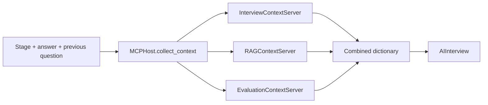

# Context orchestration

The `backend/mcp/` directory provides a small Python abstraction for assembling interview context. Its names reflect an MCP-inspired design, but it does **not** implement the Model Context Protocol transport, handshake, tools, or resources.

| Provider | Output | When |
|---|---|---|
| Interview | `interview_stage`, `rules` | Every context request |
| RAG | `rag_context` | Empty without an answer; otherwise resume/JD retrieval |
| Evaluation | `evaluation` | Only when both question and answer are present |

The host calls providers **sequentially** and merges dictionaries with `update`; later providers can overwrite earlier keys. Provider failures propagate. There is no schema enforcement or isolated service process.

`AIInterview` uses stage for the first question, then stage, retrieved context, and answer for follow-ups. Rules and evaluation are collected but are not inserted into those prompt templates. Evaluation is returned separately to the text handler.

This boundary keeps context responsibilities inspectable. It does not establish protocol compatibility or LLM tool calling.
