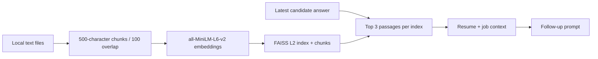

# Resume and job retrieval

Retrieval-augmented generation (RAG) gives the interviewer relevant document passages when creating a follow-up.

## Implementation

[`RAGIngestor`](../backend/ai/rag/ingest.py) reads plain text, splits it, embeds chunks, and serializes an index/chunk pair to `data/embeddings/<tag>.pkl`. [`RAGRetriever`](../backend/ai/rag/retriever.py) loads that file and searches by the latest answer.

The context provider opens the fixed `resume` and `jd` indexes. It retrieves three passages from each and formats them for the follow-up prompt. Initial questions do not use document passages. Use sufficiently long, non-empty sample documents with at least three chunks per index; fewer chunks can produce invalid FAISS result positions.

## Data boundaries

- Input support is plain text; PDF/DOCX parsing and browser uploads are absent.
- Indexes are shared local files, with no user ownership, persistence service, or deletion API.
- Only load pickle indexes generated by trusted local code; pickle loading can execute code.
- Document passages enter prompts sent to external LLM providers. Use synthetic data for demonstrations.
- There is no relevance threshold, citation output, or retrieval-quality benchmark.

See [setup](getting_started.md#backend-development) for index generation. Generated indexes are ignored by Git.
